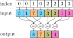
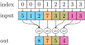

## paddle_scatter

paddle_scatter 是基于 Paddle 3.0 框架所开发的稀疏计算 API 拓展仓库，包括 scatter，segment，gather 三大类稀疏计算 API。仓库原型参照：[pytorch_scatter](https://github.com/rusty1s/pytorch_scatter)。拓展仓库中的稀疏计算 API 通过 Paddle 原生 python API 以及自定义 C++ 算子实现。


## 运行条件

* Paddle 3.0
> cpu 版本或 gpu 版本均可


## 运行说明

* Package Build
```sh
cd PaddleScatter
python setup_ops.py install
pip install .
```

* Simple Example
```py
import paddle
from paddle_scatter import scatter_max

src = paddle.to_tensor([[2, 0, 1, 4, 3], [0, 2, 1, 3, 4]])
index = paddle.to_tensor([[4, 5, 4, 2, 3], [0, 0, 2, 2, 1]])

out, argmax = scatter_max(src, index, dim=-1)

print(out)
Tensor(shape=[2, 6], dtype=int64, place=Place(gpu:0), stop_gradient=True,
       [[0, 0, 4, 3, 2, 0],
        [2, 4, 3, 0, 0, 0]])

print(argmax)
Tensor(shape=[2, 6], dtype=int64, place=Place(gpu:0), stop_gradient=True,
       [[5, 5, 3, 4, 0, 1],
        [1, 4, 3, 5, 5, 5]])
```


## 测试说明

```sh
pip install pytest
cd PaddleScatter/paddle_scatter
pytest tests
```


## 技术架构

* 一级 API：
scatter，segment_coo，segment_csr，gather_coo，gather_csr

* 二级 API：
scatter_add，scatter_mean，scatter_mul，scatter_min，scatter_max；
segment_sum_coo, segment_add_coo, segment_mean_coo, segment_min_coo, segment_max_coo；
segment_sum_csr, segment_add_csr, segment_mean_csr, segment_min_csr, segment_max_csr

* 组合 API：
scatter_softmax，scatter_log_softmax，scatter_logsumexp

* Paddle 自定义 C++ 算子以及扩展技术说明:
自定义 C++ 算子：https://www.paddlepaddle.org.cn/documentation/docs/zh/guides/custom_op/new_cpp_op_cn.html
自定义 C++ 扩展：https://www.paddlepaddle.org.cn/documentation/docs/zh/guides/custom_op/cpp_extension_cn.html


## 简要文档

### paddle_scatter.scatter:

> scatter(src: paddle.Tensor, index: paddle.Tensor, dim: int = -1, out: Optional[paddle.Tensor] = None, dim_size: Optional[int] = None, reduce: Optional[str] = "sum")

分散计算，将 `src` 按照指定的 `index` 延 `dim` 轴进行 `reduce` 规约合并。若指定 `out` 则输出到 `out`，若指定 `dim_size` 则规约后输出的 `dim` 维的维数是 `dim_size`。

符号表示：
- `src` 形状：$ (x_0, ..., x_{i-1}, x_i, x_{i+1}, ..., x_{n-1}) $
其中 $ i $ = `dim`
- `index` 形状：$ (x_0, ..., x_{i-1}, x_i, x_{i+1}, ..., x_{n-1}) $
其中 $ i $ = `dim`
- `out` 形状: $ (x_0, ..., x_{i-1}, y, x_{i+1}, ..., x_{n-1}) $
- `index` 的值必须属于 $ \{0, 1, ..., y-1\} $，且值的顺序大小没有限制

此 API 对 `index` 支持广播，所以 `index` 的形状还可以是：$ (x_i, ) $ 或 $ (d_0, d_1, ..., d_{i-1}, x_i) $，其中 $ d_k (k <= i-1) $ 可以是 $ 1 $ 或 $ x_k $

以一维情况下 `reduce = "sum"` 为例，数学计算公式为：
$$
\mathrm{out}_i = \mathrm{out}_i + \sum_{j\in\{j: \mathrm{index}_j = i\}}~\mathrm{src}_j
$$



参数：
- **src** (paddle.Tensor) - 源 tensor。
- **index** (paddle.Tensor) - 用于分散计算的指定下标，形状请参考上述文档。
- **dim** (int) - 分散计算的目标维度。默认值为 -1。
- **out** (paddle.Tensor，可选) - 输出 tensor。默认值为 None。
- **dim_size** (int，可选) - 若未指定 `out`，输出 tensor 在 `dim` 维的维数将被设为 `dim_size`；若未指定 `dim_size`，输出 tensor 在 `dim` 维的维数将被自动设为 `index.max() + 1`。默认值为 None。
- **reduce** (str，可选) - 规约类型，支持 "sum"，"add"，"mul"，"mean"，"min"，"max"。默认值为 "sum"。

返回：
分散规约计算后的 tensor。

代码示例：
```py
from paddle_scatter import scatter

src = paddle.randn([10, 6, 64])
index = paddle.tensor([0, 1, 0, 1, 2, 1])

# Broadcasting in the first and last dim
out = scatter(src, index, dim=1, reduce="sum")
print(out.shape)
[10, 3, 64]

# Specify `dim_size`
out = scatter(src, index, dim=1, dim_size=4, reduce="sum")
print(out.shape)
[10, 4, 64]

# Specify `out`
out = paddle.empty([10, 3, 64])
scatter(src, index, dim=1, out=out, reduce="sum")
print(out.shape)
[10, 3, 64]
```


### paddle_scatter.segment_coo:

> segment_coo(src: paddle.Tensor, index: paddle.Tensor, out: Optional[paddle.Tensor] = None, dim_size: Optional[int] = None, reduce: Optional[str] = "sum")

以 coordinate 的稀疏格式分段计算，将 `src` 沿 `index` 最后一维，按照 `index` 的值分组进行 `reduce` 规约合并。若指定 `out` 则输出到 `out`，若指定 `dim_size` 则规约后输出的 `dim` 维的维数是 `dim_size`。

符号表示：
- `src` 形状：$ (x_1, ..., x_{m-1}, x_m, x_{m+1}, ..., x_n) $
- `index` 形状：$ (x_1, ..., x_{m-1}, x_m) $
- `out` 形状: $ (x_1, ..., x_{m-1}, y, x_{m+1}, ..., x_n) $
- `index` 的值必须属于 $ \{0, 1, ..., y-1\} $，且值的顺序必须是升序

此 API 对 `index` 支持广播，所以 `index` 的形状还可以是：$ (d_1, d_2, ..., d_{m-1}, x_m) $，其中 $ d_k (k <= m-1) $ 可以是 $ 1 $ 或 $ x_k $

以一维情况下 `reduce = "sum"` 为例，数学计算公式为：
$$
\mathrm{out}_i = \mathrm{out}_i + \sum_{j\in\{j: \mathrm{index}_j = i\}}~\mathrm{src}_j
$$



参数：
- **src** (paddle.Tensor) - 源 tensor。
- **index** (paddle.Tensor) - 用于分段计算的指定下标，形状请参考上述文档。
- **out** (paddle.Tensor，可选) - 输出 tensor。默认值为 None。
- **dim_size** (int，可选) - 若未指定 `out`，输出 tensor 在 `dim` 维的维数将被设为 `dim_size`；若未指定 `dim_size`，输出 tensor 在 `dim` 维的维数将被自动设为 `index.max() + 1`。默认值为 None。
- **reduce** (str，可选) - 规约类型，支持 "sum"，"add"，"mean"，"min"，"max"。默认值为 "sum"。

返回：
以 coordinate 的稀疏格式分段规约计算后的 tensor。

代码示例：
```py
from paddle_scatter import segment_coo

src = paddle.randn([10, 6, 64])
index = paddle.to_tensor([0, 0, 1, 1, 1, 2])
index = index.view(1, -1)  # Broadcasting in the first and last dim.

out = segment_coo(src, index, reduce="sum")

print(out.shape)
[10, 3, 64]
```

### paddle_scatter.segment_csr:

> segment_csr(src: paddle.Tensor, indptr: paddle.Tensor, out: Optional[paddle.Tensor] = None, reduce: Optional[str] = "sum")

以 compressed sparse row 的稀疏格式分段计算，将 `src` 沿 `indptr` 最后一维，按照 `indptr` 指定的下标范围进行分段 `reduce` 规约合并。若指定 `out` 则输出到 `out`。

符号表示：
- `src` 形状：$ (x_1, ..., x_{m-1}, x_m, x_{m+1}, ..., x_n) $
- `indptr` 形状：$ (x_1, ..., x_{m-1}, y) $，其中 $ y $ 的大小无限制
- `out` 形状: $ (x_1, ..., x_{m-1}, y - 1, x_{m+1}, ..., x_n) $
- `indptr` 的值必须属于 $ \{0, 1, ..., x_m\} $，且值的顺序必须是升序

此 API 对 `indptr` 支持广播，所以 `indptr` 的形状还可以是：$ (d_1, d_2, ..., d_{m-1}, y) $，其中 $ d_k (k <= m-1) $ 可以是 $ 1 $ 或 $ x_k $

以一维情况下 `reduce = "sum"` 为例，数学计算公式为：
$$
\mathrm{out}_i =
\sum_{j = \mathrm{indptr}[i]}^{\mathrm{indptr}[i+1]-1}~\mathrm{src}_j
$$


参数：
- **src** (paddle.Tensor) - 源 tensor。
- **indptr** (paddle.Tensor) - 用于分段计算的下标指针，形状请参考上述文档。
- **out** (paddle.Tensor，可选) - 输出 tensor。默认值为 None。
- **reduce** (str，可选) - 规约类型，支持 "sum"，"add"，"mean"，"min"，"max"。默认值为 "sum"。

返回：
以 compressed sparse row 的稀疏格式分段规约计算后的 tensor。

代码示例：
```py
from paddle_scatter import segment_csr

src = paddle.randn([10, 6, 64])
indptr = paddle.tensor([0, 2, 5, 6])
indptr = indptr.view(1, -1)  # Broadcasting in the first and last dim.

out = segment_csr(src, indptr, reduce="sum")

print(out.shape)
[10, 3, 64]
```

### paddle_scatter.gather_coo:

> gather_coo(src: paddle.Tensor, index: paddle.Tensor, out: Optional[paddle.Tensor] = None)

以 coordinate 的稀疏格式，沿着 `index` 最后一维，从 `src` 中按照 `index` 的下标值取出对应元素。若指定 `out` 则输出到 `out`。

符号表示：
- `src` 形状：$ (x_1, ..., x_{m-1}, x_m, x_{m+1}, ..., x_n) $
- `index` 形状：$ (x_1, ..., x_{m-1}, y) $，其中 $ y $ 的大小无限制
- `out` 形状: $ (x_1, ..., x_{m-1}, y, x_{m+1}, ..., x_n) $
- `index` 的值必须属于 $ \{0, 1, ..., x_m - 1\} $，且值的顺序必须是升序

此 API 对 `index` 支持广播，所以 `index` 的形状还可以是：$ (d_1, d_2, ..., d_{m-1}, y) $，其中 $ d_k (k <= m-1) $ 可以是 $ 1 $ 或 $ x_k $

以一维情况为例，数学计算公式为：
$$
\mathrm{out}_{i} = \mathrm{src}_{\mathrm{index}_{i}}
$$


参数：
- **src** (paddle.Tensor) - 源 tensor。
- **index** (paddle.Tensor) - 稀疏取出操作的指定下标，形状请参考上述文档。
- **out** (paddle.Tensor，可选) - 输出 tensor。默认值为 None。

返回：
以 coordinate 的稀疏格式取出的 tensor。

代码示例：
```py
from paddle_scatter import gather_coo

src = paddle.to_tensor([1, 2, 3, 4])
index = paddle.to_tensor([0, 0, 1, 1, 1, 3])

out = gather_coo(src, index)

print(out)
Tensor(shape=[6], dtype=int64, place=Place(cpu), stop_gradient=True,
[1, 1, 2, 2, 2, 4])
```

### paddle_scatter.gather_csr:

> gather_csr(src: paddle.Tensor, indptr: paddle.Tensor, out: Optional[paddle.Tensor] = None)

以 compressed sparse row 的稀疏格式，沿 `indptr` 最后一维，按照 `indptr` 指定的下标范围从 `src` 中取出对应元素。若指定 `out` 则输出到 `out`。

符号表示：
- `src` 形状：$ (x_1, ..., x_{m-1}, x_m, x_{m+1}, ..., x_n) $
- `indptr` 形状：$ (x_1, ..., x_{m-1}, y) $，其中需满足 $ y = x_m + 1 $
- `out` 形状: $ (x_1, ..., x_{m-1}, k, x_{m+1}, ..., x_n) $，其中 $ k $ 指 `indptr` 所指示的下标分段数
- `indptr` 的值必须属于 $ \{0, 1, ..., x_m\} $，且值的顺序必须是升序

此 API 对 `indptr` 支持广播，所以 `indptr` 的形状还可以是：$ (d_1, d_2, ..., d_{m-1}, y) $，其中 $ d_k (k <= m-1) $ 可以是 $ 1 $ 或 $ x_k $

以一维情况为例，数学计算公式为：
$$
\mathrm{out}[i] = \mathrm{src}[indptr[k]]
$$

$$
k = indptr[(indptr - i <= 0)][-1]
$$


参数：
- **src** (paddle.Tensor) - 源 tensor。
- **indptr** (paddle.Tensor) - 稀疏取出操作的下标指针，形状请参考上述文档。
- **out** (paddle.Tensor，可选) - 输出 tensor。默认值为 None。


返回：
以 compressed sparse row 的稀疏格式取出的 tensor。

代码示例：
```py
from paddle_scatter import gather_csr

src = paddle.to_tensor([1, 2, 3, 4])
indptr = paddle.to_tensor([0, 2, 5, 5, 6])

out = gather_csr(src, indptr)

print(out)
Tensor(shape=[6], dtype=int64, place=Place(cpu), stop_gradient=True,
[1, 1, 2, 2, 2, 4])
```
